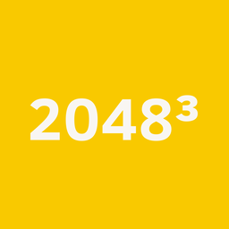

# 2048³


2048³ is a browser game that reimagines 2048 on three visible faces of a cube. Combine matching tiles, complete every face, and keep playing for a higher score.

## 2048³


Each face is an independent 4×4 board. A global move affects two faces at once, but tiles never cross from one face to another.

## Play Online

Play at [shaunkim.github.io/2048-cube-web](https://shaunkim.github.io/2048-cube-web/).

## Get the Game

- [GitHub repository](https://github.com/shaunkim/2048-cube-web)
- App Store — Coming soon
- Google Play — Coming soon

## How It Works

Merge equal tiles to make larger values. The goal is to create a 2048 tile on all three faces. Reaching that goal does not end the game: play can continue indefinitely.

Every move targets two faces and applies the following local directions:

| Global direction | Moving faces |
| --- | --- |
| Up | Left: up; Right: up |
| Down | Left: down; Right: down |
| Up-left | Top: up; Left: left |
| Up-right | Top: right; Right: right |
| Down-left | Top: left; Right: left |
| Down-right | Top: down; Left: right |

Each changed face receives its own new tile. A face with no legal moves becomes frozen: it no longer moves or receives new tiles, while the other faces remain playable. The run ends only when all three faces are frozen.

Score gains use a multiplier based on completed faces: ×1 before any face reaches 2048, then ×2, ×4, and ×8 as one, two, and three faces have completed the goal.

## Controls

Swipe in any of six directions on touch devices. On a keyboard:

| Key | Direction |
| --- | --- |
| Q | Up-left |
| W | Up |
| E | Up-right |
| A | Down-left |
| S | Down |
| D | Down-right |

## Run Locally

```bash
npm ci
npm run web
```

## Build

Create a production web export with:

```bash
npm run build:web
```

## Feedback / Support

Please report browser problems or suggest gameplay ideas through [GitHub Issues](https://github.com/shaunkim/2048-cube-web/issues).

## Open Source / License

2048³ is available under the [MIT License](LICENSE). See [third-party notices](THIRD_PARTY_NOTICES.md) for bundled font licensing and project attribution.

## Acknowledgments

2048³ is inspired by Gabriele Cirulli’s MIT-licensed [2048](https://github.com/gabrielecirulli/2048), and its visual palette is adapted from that project. This project is not affiliated with or endorsed by Gabriele Cirulli or the original 2048 project.

Clear Sans is bundled under the Apache License 2.0; its license is included at [assets/ClearSans-LICENSE.txt](assets/ClearSans-LICENSE.txt).

This project was built with help from Codex.

## Why I Built This

I am an aerospace engineer, and extending two-dimensional data into three dimensions is part of my work as a CFD engineer. The idea for 2048³ came to me when I first played 2048, but I did not know how to program it into reality. As a small side project, AI-assisted coding finally gave me a way to build and share it.
